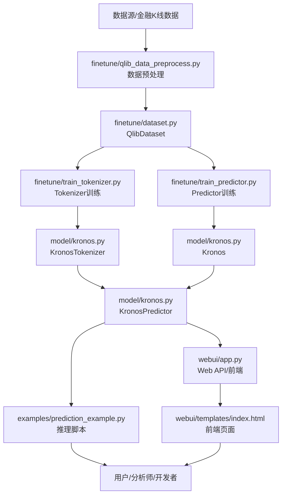

# Kronos 项目全景文档

## 目录
1. 项目简介与背景
2. 功能特性概览
3. 系统架构与模块分解
4. 数据流与核心流程
5. 训练与微调（Finetune）
6. 推理与API/WebUI
7. 关键代码结构与接口说明
8. 开发与部署建议
9. 常见问题（FAQ）
10. 参考资料与扩展阅读

---

## 1. 项目简介与背景
Kronos 是面向金融市场K线（Candlestick）数据的开源基础大模型，具备端到端的金融时序建模、预测、微调与可视化能力。其核心创新在于：
- 首创金融K线分层离散化Tokenizer，适配大模型token输入
- 基于Transformer的自回归建模，兼容多市场多品种
- 支持高效微调、批量预测、Web可视化等全流程

应用场景包括：量化交易、金融信号建模、行情预测、策略研究、AI金融数据分析等。

## 2. 功能特性概览
- 金融K线数据的分层量化与token化
- 多层次Transformer模型，支持多市场/多品种/多频率
- 高效批量预测与并行推理
- 完整的微调（finetune）流水线，支持Qlib等主流金融数据
- WebUI可视化，支持参数调优、K线对比、误差分析
- 端到端自动化脚本与配置集中管理

## 3. 系统架构与模块分解



### 3.1 主要目录与文件说明
- `finetune/`：数据预处理、数据集、训练脚本、配置、工具等
- `model/`：核心模型、量化器、嵌入、注意力等
- `examples/`：推理与可视化脚本
- `webui/`：Web后端、前端、API、依赖
- `requirements.txt`：主依赖清单

### 3.2 关键模块解读
- **数据处理**：Qlib数据加载、滑窗采样、特征工程、标准化
- **Tokenizer**：K线分层离散化，支持自定义位宽与分组
- **主模型Kronos**：多层Transformer，分层嵌入、RMSNorm、RoPE、DualHead输出
- **推理封装**：归一化、token化、模型推理、反归一化
- **WebUI**：Flask后端+Plotly前端，支持多模型、多参数、K线对比

## 4. 数据流与核心流程

### 4.1 数据流全景
1. Qlib等金融数据库 → 预处理 → 标准化pkl数据集
2. 滑窗采样 → Tokenizer训练/主模型训练
3. 推理时：原始K线 → 归一化 → Tokenizer编码 → Kronos预测 → 反量化还原
4. WebUI/脚本 → API调用 → 结果可视化与分析

### 4.2 训练与推理流程
详见下方“训练与微调”“推理与API”章节。

## 5. 训练与微调（Finetune）

### 5.1 数据准备
- 按`finetune/config.py`配置Qlib数据路径、时间区间、特征等
- 运行`finetune/qlib_data_preprocess.py`，生成train/val/test数据集（pkl）

### 5.2 Tokenizer训练

- 运行`finetune/train_tokenizer.py`，支持多GPU分布式训练
- 训练目标：让Tokenizer适应目标市场/品种的K线分布
- 输出：最佳Tokenizer权重

#### 金融K线分层离散化Tokenizer原理与实现

Kronos项目首创的K线分层离散化Tokenizer，专为金融时序数据（如OHLCV）设计，核心思想是将连续、多维的K线数据高效编码为离散token序列，使其能够被大模型（如Transformer）直接处理。

**原理概述：**
- 传统NLP Tokenizer处理文本离散符号，金融K线为高维连续数值，需先离散化。
- KronosTokenizer采用两级分层量化：
  - **Pre-token（s1）**：粗粒度量化，捕捉主趋势
  - **Post-token（s2）**：细粒度补充，提升表达能力
- 每根K线（如open、high、low、close、volume等）经归一化后，输入Tokenizer，输出一组分层token（s1_bits+s2_bits位宽），可灵活适配不同模型容量。

**核心结构与代码接口：**
- 见`model/kronos.py`中的`KronosTokenizer`类：
  - 继承自`nn.Module`，支持PyTorch训练与推理
  - 构造函数支持自定义输入维度、模型宽度、量化位宽、分组等
  - 内部集成`BinarySphericalQuantizer`（见`model/module.py`），实现高效二值化与分组熵约束
  - 支持多层Transformer编码器/解码器结构，提升表达能力

**关键代码片段：**

```python
class KronosTokenizer(nn.Module, PyTorchModelHubMixin):
    def __init__(self, d_in, d_model, n_heads, ff_dim, n_enc_layers, n_dec_layers, ...):
        ...
        self.embed = nn.Linear(self.d_in, self.d_model)
        # Encoder Transformer Blocks
        self.encoder = nn.ModuleList([...])
        # 分层量化器
        self.quantizer = BSQuantizer(s1_bits, s2_bits, ...)
        ...
    def forward(self, x):
        x = self.embed(x)
        for block in self.encoder:
            x = block(x)
        # 分层量化，输出s1/s2 token
        _, quantized, (s1_ids, s2_ids) = self.quantizer(x, half=True)
        return s1_ids, s2_ids
```

**适配大模型token输入机制：**
- 通过分层量化，连续K线数据被编码为一组离散token（整数ID），可直接作为Transformer等大模型的输入序列。
- 支持灵活调整token位宽（如s1_bits=8, s2_bits=8），兼容不同模型容量与下游任务。
- 量化过程引入分组熵约束，提升token分布多样性，避免信息损失。
- 训练时，Tokenizer可独立微调，适应不同市场/品种/频率的数据分布。

**优势总结：**
- 兼容高维、多市场、多频率金融数据，极大提升大模型对金融时序的建模能力
- Tokenizer与主模型解耦，便于迁移学习与多任务扩展
- 量化参数可调，适配不同算力与精度需求

如需进一步了解Tokenizer底层量化算法、分组熵约束或与主模型的协同机制，可指定相关文件深入分析。

### 5.3 Predictor训练
- 运行`finetune/train_predictor.py`，同样支持多GPU
- 训练目标：基于token序列自回归预测未来K线
- 输出：最佳Kronos主模型权重

### 5.4 配置与超参数
- 所有路径、超参数、分割区间均集中在`finetune/config.py`，便于自动化与复现实验

### 5.5 评估与回测
- 运行`finetune/qlib_test.py`，支持批量推理与简单回测
- 输出：预测信号、回测收益曲线、误差分析等

## 6. 推理与API/WebUI

### 6.1 脚本推理
- 参考`examples/prediction_example.py`，支持单序列/批量预测
- 输入：标准K线csv，输出：未来K线预测结果

### 6.2 WebUI
- `webui/app.py`为Flask后端，支持模型加载、数据上传、参数调优、预测、结果保存等API
- `webui/templates/index.html`为前端，支持K线图、参数滑块、误差对比等
- 支持多模型（mini/small/base）、多设备（CPU/CUDA/MPS）、多种采样参数

### 6.3 API接口示例
- `/predict`：POST，输入K线数据与参数，返回预测结果
- `/load_model`：POST，选择模型与设备
- `/get_data_files`：GET，列出可用数据文件

## 7. 关键代码结构与接口说明

### 7.1 Tokenizer核心接口
- `KronosTokenizer.forward(x)`：输入归一化K线，输出分层token
- 支持自定义位宽、分组、量化参数

### 7.2 Kronos主模型接口
- `Kronos.forward(s1_ids, s2_ids, ...)`：输入token序列，输出预测token
- 支持teacher forcing、mask、时间嵌入等

### 7.3 KronosPredictor推理接口
- `predict(df, x_timestamp, y_timestamp, pred_len, T, top_k, top_p, sample_count, ...)`
  - 输入：历史K线DataFrame、时间戳、预测步数、采样参数
  - 输出：未来K线DataFrame
- `predict_batch(...)`：批量预测接口

### 7.4 WebUI后端主要API
- `load_model()`：加载指定模型到指定设备
- `predict()`：执行推理，返回预测与误差分析
- `get_available_models()`：列出可用模型

## 8. 开发与部署建议

- 推荐使用Python 3.10+，CUDA 11+环境
- 训练建议多GPU，推理支持CPU/CUDA/MPS
- 配置集中管理，便于自动化与大模型集成
- WebUI适合快速原型、演示与人机协作
- 代码注释多为英文，便于国际化与大模型理解

## 9. 常见问题（FAQ）

**Q1：如何适配自己的金融数据？**
A：按`finetune/config.py`配置数据路径与特征，确保字段齐全，运行预处理脚本即可。

**Q2：如何扩展支持新的采样/预测参数？**
A：修改`KronosPredictor`与WebUI参数解析部分，前后端均易于扩展。

**Q3：模型推理慢/显存不足？**
A：可选用mini/small模型，或调整batch size、采样参数，或使用更高性能设备。

**Q4：如何集成到自己的量化/AI平台？**
A：可直接调用`KronosPredictor`类，或通过Web API对接，或参考examples脚本二次开发。

## 10. 参考资料与扩展阅读

- Kronos官方README与论文：https://arxiv.org/abs/2508.02739
- Qlib项目：https://github.com/microsoft/qlib
- Hugging Face Transformers文档
- PyTorch官方文档

---
如需进一步细化某一模块、流程或代码实现，可指定文件或功能点继续深入分析。
